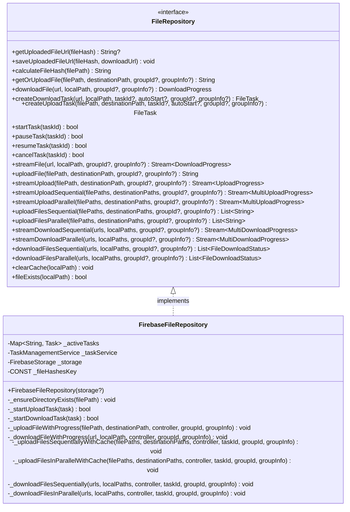
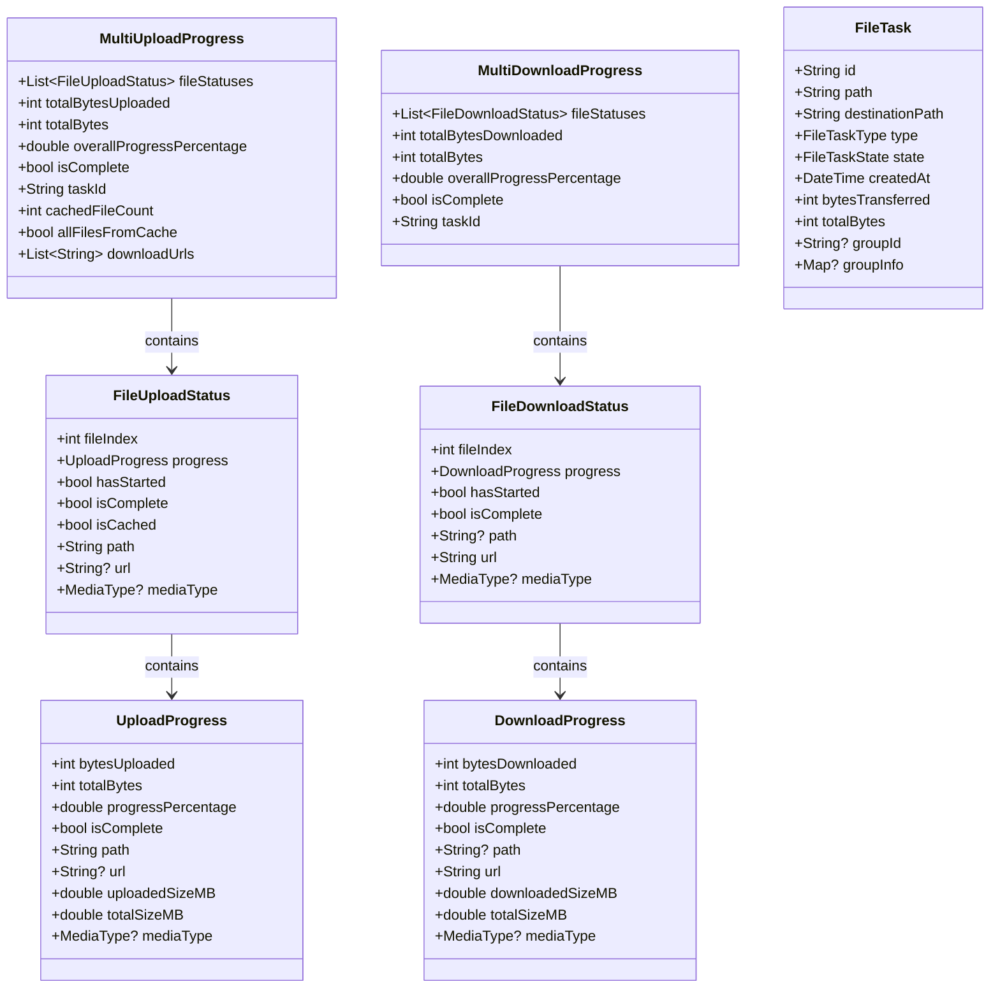

# File Repository System

This directory contains the core repository classes for the File Management System that handle file operations with Firebase Storage.

## Overview

The repository layer implements file upload, download, caching, and deduplication features using the Repository Pattern for clean separation of concerns. It provides a unified API for all file operations while abstracting the underlying storage implementation details.

## Architecture

The system follows the Repository Pattern with two main components:

1. **FileRepository Interface**: Defines the contract for all file operations
2. **FirebaseFileRepository**: Implements the interface using Firebase Storage



## Key Components

### FileRepository Interface

The `FileRepository` abstract class defines the contract for all file operations:

#### Cache and Deduplication Methods

- `getUploadedFileUrl(fileHash)`: Retrieves cached URL for a file hash
- `saveUploadedFileUrl(fileHash, downloadUrl)`: Saves file hash and URL to cache
- `calculateFileHash(filePath)`: Computes SHA-256 hash for a file
- `getOrUploadFile(filePath, destinationPath, groupId?, groupInfo?)`: Uploads file only if not in cache

#### Upload Methods

- `uploadFile(filePath, destinationPath, groupId?, groupInfo?)`: Uploads a single file
- `uploadFilesSequential(filePaths, destinationPaths, groupId?, groupInfo?)`: Uploads multiple files sequentially
- `uploadFilesParallel(filePaths, destinationPaths, groupId?, groupInfo?)`: Uploads multiple files in parallel

#### Download Methods

- `downloadFile(url, localPath, groupId?, groupInfo?)`: Downloads a single file
- `downloadFilesSequential(urls, localPaths, groupId?, groupInfo?)`: Downloads multiple files sequentially
- `downloadFilesParallel(urls, localPaths, groupId?, groupInfo?)`: Downloads multiple files in parallel

#### Stream-Based Methods

- `streamUpload(filePath, destinationPath, groupId?, groupInfo?)`: Streams upload progress for a single file
- `streamUploadSequential(filePaths, destinationPaths, groupId?, groupInfo?)`: Streams progress for sequential uploads
- `streamUploadParallel(filePaths, destinationPaths, groupId?, groupInfo?)`: Streams progress for parallel uploads
- `streamFile(url, localPath, groupId?, groupInfo?)`: Streams download progress for a single file
- `streamDownloadSequential(urls, localPaths, groupId?, groupInfo?)`: Streams progress for sequential downloads
- `streamDownloadParallel(urls, localPaths, groupId?, groupInfo?)`: Streams progress for parallel downloads

#### Task Management Methods

- `createUploadTask(filePath, destinationPath, taskId?, autoStart?, groupId?, groupInfo?)`: Creates a manageable upload task
- `createDownloadTask(url, localPath, taskId?, autoStart?, groupId?, groupInfo?)`: Creates a manageable download task
- `startTask(taskId)`: Starts a previously created task
- `pauseTask(taskId)`: Pauses a running task
- `resumeTask(taskId)`: Resumes a paused task
- `cancelTask(taskId)`: Cancels a task

#### Cache Management Methods

- `clearCache(localPath)`: Deletes a cached file
- `fileExists(localPath)`: Checks if a file exists in cache

### FirebaseFileRepository Implementation

The `FirebaseFileRepository` class implements the `FileRepository` interface using Firebase Storage:

- Manages connections to Firebase Storage through the `firebase_storage` package
- Implements progress tracking for uploads and downloads using the `Task` and `StreamController` classes
- Handles file hash calculation for deduplication using the `crypto` package
- Stores file hashes and URLs for cache-aware uploads using `SharedPreferences`
- Implements parallel and sequential file operations with proper error handling
- Maintains a map of active Firebase tasks for proper task control

## Batch Operations and Group Information

The repository supports batch operations with detailed group information:

- A `groupId` uniquely identifies a batch of related tasks
- `groupInfo` contains metadata about the batch, including:
  - `name`: User-friendly name (e.g., "Backup May-12-2025")
  - `createdAt`: Timestamp when the batch was created
  - `totalFiles`: Number of files in the batch
  - `description`: Optional notes about the batch

### Working with Group Info

When creating tasks that are part of a batch:

```dart
// Create a batch upload with rich metadata
final groupInfo = {
  'name': 'July 2023 Vacation Photos',
  'createdAt': Timestamp.now(),
  'totalFiles': filePaths.length,
  'description': 'Photos from our trip to Hawaii',
};

// Upload multiple files as a batch with group info
repository.uploadFilesParallel(
  filePaths: filePaths,
  destinationPaths: destinationPaths,
  groupId: batchId,
  groupInfo: groupInfo,
);
```

## Data Models

### Progress Tracking Models



#### UploadProgress

Tracks the progress of a single file upload:

- `bytesUploaded`: Number of bytes uploaded so far
- `totalBytes`: Total file size in bytes
- `progressPercentage`: Progress as a percentage (0-100)
- `isComplete`: Whether the upload has completed
- `path`: Local file path being uploaded
- `url`: Download URL (available when complete)
- `uploadedSizeMB`: Uploaded data in MB
- `totalSizeMB`: Total size in MB
- `mediaType`: Type of media being uploaded (getter)

#### DownloadProgress

Tracks the progress of a single file download:

- `bytesDownloaded`: Number of bytes downloaded so far
- `totalBytes`: Total file size in bytes
- `progressPercentage`: Progress as a percentage (0-100)
- `isComplete`: Whether the download has completed
- `path`: Local file path where downloaded (available when complete)
- `url`: URL being downloaded
- `downloadedSizeMB`: Downloaded data in MB
- `totalSizeMB`: Total size in MB
- `mediaType`: Type of media being downloaded (getter)

#### MultiUploadProgress

Tracks progress of multiple file uploads:

- `fileStatuses`: List of individual file statuses
- `totalBytesUploaded`: Combined bytes uploaded
- `totalBytes`: Combined total bytes
- `overallProgressPercentage`: Overall progress percentage
- `isComplete`: Whether all uploads are complete
- `taskId`: Unique identifier for this multi-upload
- `cachedFileCount`: Number of files served from cache (getter)
- `allFilesFromCache`: Whether all files came from cache (getter)
- `downloadUrls`: List of download URLs for completed files (getter)

#### MultiDownloadProgress

Tracks progress of multiple file downloads:

- `fileStatuses`: List of individual file statuses
- `totalBytesDownloaded`: Combined bytes downloaded
- `totalBytes`: Combined total bytes
- `overallProgressPercentage`: Overall progress percentage
- `isComplete`: Whether all downloads are complete
- `taskId`: Unique identifier for this multi-download

#### FileTask with Group Support

Manages individual file tasks with batch capabilities:

- Standard task properties (id, path, state, etc.)
- `groupId`: Optional identifier linking related tasks as a batch
- `groupInfo`: Optional metadata map containing batch information:
  - `name`: User-friendly batch name
  - `createdAt`: Timestamp when the batch was created
  - `totalFiles`: Number of files in the batch
  - `description`: Optional notes about the batch

## Deduplication & Caching

The system implements intelligent deduplication to avoid redundant uploads:

1. When a file is uploaded, a SHA-256 hash is calculated for its content using the `crypto` package
2. The hash is used to check if the file was previously uploaded by looking up in `SharedPreferences`
3. If the file was previously uploaded, the existing URL is returned immediately
4. If not, the file is uploaded and its hash and URL are stored for future reference

```dart
// Key methods for deduplication
Future<String?> getUploadedFileUrl(String fileHash);
Future<void> saveUploadedFileUrl(String fileHash, String downloadUrl);
Future<String> calculateFileHash(String filePath);
Future<String> getOrUploadFile(String filePath, String destinationPath);
```

### Implementation Details

The deduplication system uses a persistent store to maintain file hashes:

```dart
// In FirebaseFileRepository
static const String _fileHashesKey = 'file_management_file_hashes';

@override
Future<String?> getUploadedFileUrl(String fileHash) async {
  try {
    final prefs = await SharedPreferences.getInstance();
    final fileHashesJson = prefs.getString(_fileHashesKey);

    if (fileHashesJson != null) {
      final fileHashes = jsonDecode(fileHashesJson) as Map<String, dynamic>;
      return fileHashes[fileHash] as String?;
    }

    return null;
  } catch (e) {
    'Error retrieving file URL from hash storage: $e'.print();
    return null;
  }
}

@override
Future<void> saveUploadedFileUrl(String fileHash, String downloadUrl) async {
  try {
    final prefs = await SharedPreferences.getInstance();
    final fileHashesJson = prefs.getString(_fileHashesKey);

    final Map<String, dynamic> fileHashes;
    if (fileHashesJson != null) {
      fileHashes = jsonDecode(fileHashesJson) as Map<String, dynamic>;
    } else {
      fileHashes = {};
    }

    fileHashes[fileHash] = downloadUrl;
    await prefs.setString(_fileHashesKey, jsonEncode(fileHashes));
  } catch (e) {
    'Error saving file hash to storage: $e'.print();
  }
}
```

## Task Management

The repository supports complete task management for file operations, interfacing with the `TaskManagementService` to track tasks across app restarts.

### Task Creation

```dart
// Create an upload task with deduplication
@override
Future<FileTask> createUploadTask(String filePath, String destinationPath, {String? taskId, bool autoStart = false}) async {
  try {
    // Calculate file hash
    final fileHash = await calculateFileHash(filePath);

    // Check if file is already uploaded
    final existingUrl = await getUploadedFileUrl(fileHash);
    if (existingUrl != null) {
      // File already uploaded, create a completed task with cached status
      final fileSize = File(filePath).lengthSync();
      final id = taskId ?? 'cached_${const Uuid().v4()}';

      final task = _taskService.createUploadTask(
        filePath: filePath,
        destinationPath: destinationPath,
        autoStart: false,
        downloadUrl: existingUrl,
        taskId: id,
        isCached: true,
      );

      // Mark as completed immediately
      await _taskService.updateTask(
        task.id,
        state: FileTaskState.cached,
        bytesTransferred: fileSize,
        totalBytes: fileSize,
        downloadUrl: existingUrl,
      );

      return task;
    }

    // Normal task creation for new uploads
    final task = _taskService.createUploadTask(
      filePath: filePath,
      destinationPath: destinationPath,
      autoStart: autoStart,
    );

    if (autoStart) {
      await _startUploadTask(task);
    }

    return task;
  } catch (e) {
    throw FileUploadException('Failed to create upload task: $e');
  }
}
```

### Task Control Methods

The task control methods manage Firebase Storage tasks and update the task status through the task service:

```dart
@override
Future<bool> startTask(String taskId) async {
  final task = _taskService.getTaskById(taskId);
  if (task == null) {
    return false;
  }

  try {
    if (task.type == FileTaskType.upload) {
      return await _startUploadTask(task);
    } else {
      return await _startDownloadTask(task);
    }
  } catch (e) {
    await _taskService.updateTask(taskId, state: FileTaskState.error, errorMessage: e.toString());
    return false;
  }
}
```

## Error Handling

The system includes custom exceptions for error handling:

```dart
// Custom exceptions for file operations
class FileDownloadException implements Exception {
  final String message;
  FileDownloadException(this.message);
  @override
  String toString() => 'FileDownloadException: $message';
}

class FileUploadException implements Exception {
  final String message;
  FileUploadException(this.message);
  @override
  String toString() => 'FileUploadException: $message';
}

class FileDeleteException implements Exception {
  final String message;
  FileDeleteException(this.message);
  @override
  String toString() => 'FileDeleteException: $message';
}
```

## Streaming Implementation

The stream-based methods use `StreamController` to provide real-time progress updates:

```dart
@override
Stream<UploadProgress> streamUpload(String filePath, String destinationPath) {
  final controller = StreamController<UploadProgress>();

  _uploadFileWithProgress(filePath, destinationPath, controller).catchError((error) {
    controller.addError(FileUploadException('Failed to stream upload: $error'));
    controller.close();
  });

  return controller.stream;
}
```

## Usage Examples

### Upload With Deduplication

```dart
// This will skip the upload if the file was previously uploaded
final url = await repository.getOrUploadFile(filePath, destinationPath);
```

### Stream Upload With Progress

```dart
repository.streamUpload(filePath, destinationPath)
  .listen(
    (progress) {
      if (progress.isComplete) {
        print('Upload complete: ${progress.url}');
      } else {
        print('Progress: ${progress.progressPercentage}%');
        print('Size: ${progress.uploadedSizeMB.toStringAsFixed(1)} MB / ${progress.totalSizeMB.toStringAsFixed(1)} MB');
      }
    },
    onError: (error) {
      print('Upload error: $error');
    }
  );
```

### Multiple Files Upload

```dart
// Using sets to prevent duplicates
final Set<String> filePaths = {
  '/path/to/file1.jpg',
  '/path/to/file2.pdf',
  '/path/to/file3.mp4',
};

final Set<String> destinationPaths = {
  'users/user123/images/file1.jpg',
  'users/user123/documents/file2.pdf',
  'users/user123/videos/file3.mp4',
};

repository.streamUploadParallel(filePaths, destinationPaths)
  .listen(
    (multiProgress) {
      print('Overall progress: ${multiProgress.overallProgressPercentage}%');
      print('Files from cache: ${multiProgress.cachedFileCount}');
      
      for (var status in multiProgress.fileStatuses) {
        if (status.isCached) {
          print('File ${status.path} was from cache!');
        } else if (status.isComplete) {
          print('File ${status.path} newly uploaded: ${status.url}');
        } else {
          print('File ${status.path} progress: ${status.progress.progressPercentage}%');
        }
      }
      
      if (multiProgress.isComplete) {
        print('All uploads complete. URLs: ${multiProgress.downloadUrls}');
      }
    },
    onError: (error) {
      print('Upload error: $error');
    }
  );
```

### Task-Based Upload

```dart
// Create a task without starting it
final task = await repository.createUploadTask(
  filePath, 
  destinationPath,
  autoStart: false
);

// Check if it was from cache
if (task.state == FileTaskState.cached) {
  print('File was already uploaded. URL: ${task.downloadUrl}');
} else {
  // Start the task later
  await repository.startTask(task.id);
  
  // Pause if needed
  await repository.pauseTask(task.id);
  
  // Resume later
  await repository.resumeTask(task.id);
  
  // Or cancel if no longer needed
  await repository.cancelTask(task.id);
}
```

### Downloading Files

```dart
// Single file download
repository.streamFile(downloadUrl, 'path/to/local/file.jpg')
  .listen((progress) {
    print('Download progress: ${progress.progressPercentage}%');
    
    if (progress.isComplete) {
      print('File downloaded to: ${progress.path}');
    }
  });

// Multiple file download
repository.streamDownloadParallel(urls, localPaths)
  .listen((multiProgress) {
    print('Overall download progress: ${multiProgress.overallProgressPercentage}%');
    
    if (multiProgress.isComplete) {
      print('All files downloaded');
    }
  });
```

## Dependencies

The repository implementation relies on several dependencies:

- `firebase_storage`: For Firebase Storage operations
- `path_provider`: For accessing app document directories
- `crypto`: For computing file hashes
- `shared_preferences`: For storing file hash mappings
- `uuid`: For generating unique task IDs
- `path`: For file path manipulations
