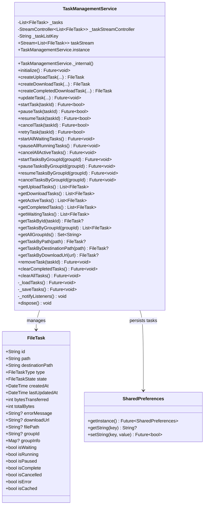
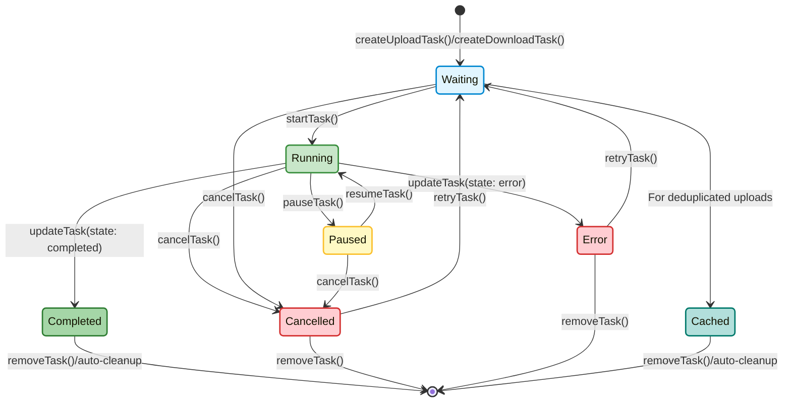

# Task Management Service

The `TaskManagementService` is a core component of the File Management System that handles the lifecycle, persistence, and state management of file upload and download tasks.

## Overview

This service provides a centralized system for tracking and controlling file operations through a robust task management architecture. It enables:

- Creating and managing file upload/download tasks
- Persisting task state across app restarts
- Streaming real-time task updates to UI components
- Batch operations for multiple tasks
- Task filtering and retrieval
- Automatic cleanup of old completed tasks
- Rich metadata for batches of tasks

## Architecture

The `TaskManagementService` is implemented as a singleton to ensure a single source of truth for task information throughout the application:



## Key Features

### Task State Management

Each task can exist in one of the following states defined in `FileTaskState`:

- **Waiting**: Task created but not started yet
- **Running**: Task is actively processing
- **Paused**: Task temporarily halted
- **Completed**: Task finished successfully
- **Cancelled**: Task was cancelled by user
- **Error**: Task failed with an error
- **Cached**: Task completed using cached data (for deduplication)

### Task Creation

The service provides methods to create both upload and download tasks with batch metadata:

```dart
// Create an upload task with group information
final uploadTask = taskService.createUploadTask(
  filePath: '/path/to/file.jpg',
  destinationPath: 'storage/path/file.jpg',
  autoStart: false, // Don't start immediately
  groupId: 'batch-123', // Optional batch identifier
  groupInfo: {  // Optional batch metadata
    'name': 'Vacation Photos 2023',
    'createdAt': DateTime.now(),
    'totalFiles': 25,
    'description': 'Photos from our trip to Hawaii'
  }
);

// Create a download task with batch information
final downloadTask = taskService.createDownloadTask(
  url: 'https://firebasestorage.googleapis.com/...',
  localPath: 'downloads/file.jpg',
  totalBytes: 1024000, // Optional size info
  autoStart: true, // Start immediately
  groupId: 'download-batch-456',
  groupInfo: {
    'name': 'Project Documents',
    'createdAt': DateTime.now(),
    'totalFiles': 5,
    'description': 'Important project files'
  }
);

// Create a completed download task (for files from cache)
final completedTask = taskService.createCompletedDownloadTask(
  url: 'https://firebasestorage.googleapis.com/...',
  localPath: 'downloads/file.jpg',
  fileSize: 1024000,
  groupId: 'download-batch-456',
  groupInfo: {
    'name': 'Project Documents',
    'createdAt': DateTime.now(),
    'totalFiles': 5,
    'description': 'Important project files'
  }
);
```

### Task Control Operations

Individual tasks can be controlled through these methods:

```dart
// Start a task
await taskService.startTask(taskId);

// Pause a running task
await taskService.pauseTask(taskId);

// Resume a paused task
await taskService.resumeTask(taskId);

// Cancel a task
await taskService.cancelTask(taskId);

// Retry a failed or cancelled task
await taskService.retryTask(taskId);
```

### Batch Operations

The service supports operations on multiple tasks simultaneously:

```dart
// Start all waiting tasks
await taskService.startAllWaitingTasks();

// Pause all running tasks
await taskService.pauseAllRunningTasks();

// Cancel all active tasks
await taskService.cancelAllActiveTasks();

// Group-specific operations
await taskService.startTasksByGroupId(groupId);
await taskService.pauseTasksByGroupId(groupId);
await taskService.resumeTasksByGroupId(groupId);
await taskService.cancelTasksByGroupId(groupId);
```

### Task Filtering

Tasks can be filtered and retrieved in various ways:

```dart
// Get all upload tasks
final uploadTasks = taskService.getUploadTasks();

// Get all download tasks
final downloadTasks = taskService.getDownloadTasks();

// Get tasks that are active (not completed, cancelled, or errored)
final activeTasks = taskService.getActiveTasks();

// Get completed tasks
final completedTasks = taskService.getCompletedTasks();

// Get waiting tasks
final waitingTasks = taskService.getWaitingTasks();

// Get tasks by group ID
final batchTasks = taskService.getTasksByGroupId(groupId);

// Get all unique group IDs
final allGroupIds = taskService.getAllGroupIds();
```

### Task Lookup

Tasks can be looked up by various identifiers:

```dart
// Find task by ID
final task = taskService.getTaskById(taskId);

// Find task by file path
final task = taskService.getTaskByPath(filePath);

// Find task by destination path
final task = taskService.getTaskByDestinationPath(destinationPath);

// Find task by download URL
final task = taskService.getTaskByDownloadUrl(downloadUrl);
```

### Real-time Task Updates

The service provides a stream for real-time task updates:

```dart
taskService.taskStream.listen((tasks) {
  // Update UI with current task list
  print('Total tasks: ${tasks.length}');
  print('Active tasks: ${tasks.where((t) => !t.isComplete && !t.isCancelled).length}');
  
  // Process tasks by group
  final tasksByGroup = groupBy(tasks.where((t) => t.groupId != null), 
    (FileTask task) => task.groupId!);
  
  for (final entry in tasksByGroup.entries) {
    final groupId = entry.key;
    final groupTasks = entry.value;
    final groupInfo = groupTasks.first.groupInfo;
    
    if (groupInfo != null) {
      print('Group ${groupInfo['name']} (${groupTasks.length} tasks)');
    }
  }
});
```

### Persistence

Task state is automatically persisted across app restarts using `SharedPreferences`:

- Tasks are saved whenever their state changes
- Group info is preserved alongside task data
- When the app restarts, tasks are reloaded from storage
- Running tasks are automatically set to paused on restart
- Old completed tasks (>7 days) are automatically cleaned up

```dart
// Implementation details
Future<void> _saveTasks() async {
  try {
    final prefs = await SharedPreferences.getInstance();
    final taskMaps = _tasks.map((task) => task.toJson()).toList();
    final tasksJson = jsonEncode(taskMaps);
    await prefs.setString(_taskListKey, tasksJson);
  } catch (e) {
    print('Error saving tasks: $e');
  }
}
```

## Task Updates

The service allows updating various properties of a task:

```dart
// Update task state and progress
await taskService.updateTask(
  taskId,
  state: FileTaskState.running,
  bytesTransferred: 512000,
  totalBytes: 1024000,
  groupId: 'batch-123',
  groupInfo: {
    'name': 'Updated Batch Name',
    'description': 'Updated description'
  }
);

// Update with error
await taskService.updateTask(
  taskId,
  state: FileTaskState.error,
  errorMessage: 'Network error occurred'
);

// Update with download URL when completed
await taskService.updateTask(
  taskId,
  state: FileTaskState.completed,
  bytesTransferred: 1024000,
  downloadUrl: 'https://firebasestorage.googleapis.com/...'
);
```

## Advanced Features

### Group Information

The `groupInfo` map contains rich metadata about a batch of tasks:

```dart
final groupInfo = {
  // User-friendly name for the batch
  'name': 'Vacation Photos 2023',
  
  // When the batch was created
  'createdAt': Timestamp.now(), // Firebase Timestamp or DateTime
  
  // How many files are in the batch
  'totalFiles': 25,
  
  // Optional description or notes
  'description': 'Photos from our trip to Hawaii'
};
```

This information is used by the `BatchOverviewScreen` to display a user-friendly interface for managing batches of uploads or downloads.

### Batch Progress Tracking

Using the group functionality, you can track the progress of an entire batch of tasks:

```dart
// Get tasks in a batch
final batchTasks = taskService.getTasksByGroupId(groupId);

// Calculate overall progress
int totalBytes = 0;
int transferredBytes = 0;

for (final task in batchTasks) {
  totalBytes += task.totalBytes;
  transferredBytes += task.bytesTransferred;
}

// Overall percentage (0-100)
final overallProgress = totalBytes > 0 ? (transferredBytes / totalBytes) * 100 : 0;

// Task status counts
final completed = batchTasks.where((t) => t.isComplete).length;
final running = batchTasks.where((t) => t.isRunning).length;
final paused = batchTasks.where((t) => t.isPaused).length;
final errors = batchTasks.where((t) => t.isError).length;

print('Batch: ${batchTasks.first.groupInfo?['name']}');
print('Progress: ${overallProgress.toStringAsFixed(1)}%');
print('Status: $completed completed, $running running, $paused paused, $errors failed');
```

### FileTask Properties

The `FileTask` class is the core data model for all tasks and includes:

- Standard task properties (id, path, status, progress, etc.)
- `groupId` for linking related tasks as a batch
- `groupInfo` containing batch metadata:
  - `name`: User-friendly batch name
  - `createdAt`: Timestamp when the batch was created
  - `totalFiles`: Number of files in the batch
  - `description`: Optional notes about the batch

## Task Lifecycle Diagram

The following diagram illustrates the complete lifecycle of a file task from creation to completion:



Notes on state transitions:

1. **Initial Creation**: Tasks start in the `Waiting` state when created without `autoStart: true`
2. **Task Execution**:
   - `startTask()` transitions from `Waiting` to `Running`
   - `pauseTask()` transitions from `Running` to `Paused`
   - `resumeTask()` transitions from `Paused` back to `Running`
3. **Completion States**:
   - `Completed`: Task finished successfully
   - `Error`: Task encountered an error
   - `Cancelled`: Task was cancelled by user
   - `Cached`: Task completed using cached data (special case for uploads with deduplication)
4. **Recovery**:
   - `retryTask()` allows returning to `Waiting` from `Error` or `Cancelled` states
5. **Cleanup**:
   - Task eventually removed from the system via explicit `removeTask()` or automatic cleanup (for tasks older than 7 days)

The `TaskManagementService` maintains this state machine and ensures consistent transitions between states.

## Dependencies

- `dart:async`: For StreamController
- `dart:convert`: For JSON encoding/decoding
- `dart:io`: For File operations
- `collection`: For firstWhereOrNull utility
- `shared_preferences`: For persisting tasks
- `uuid`: For generating unique task IDs
